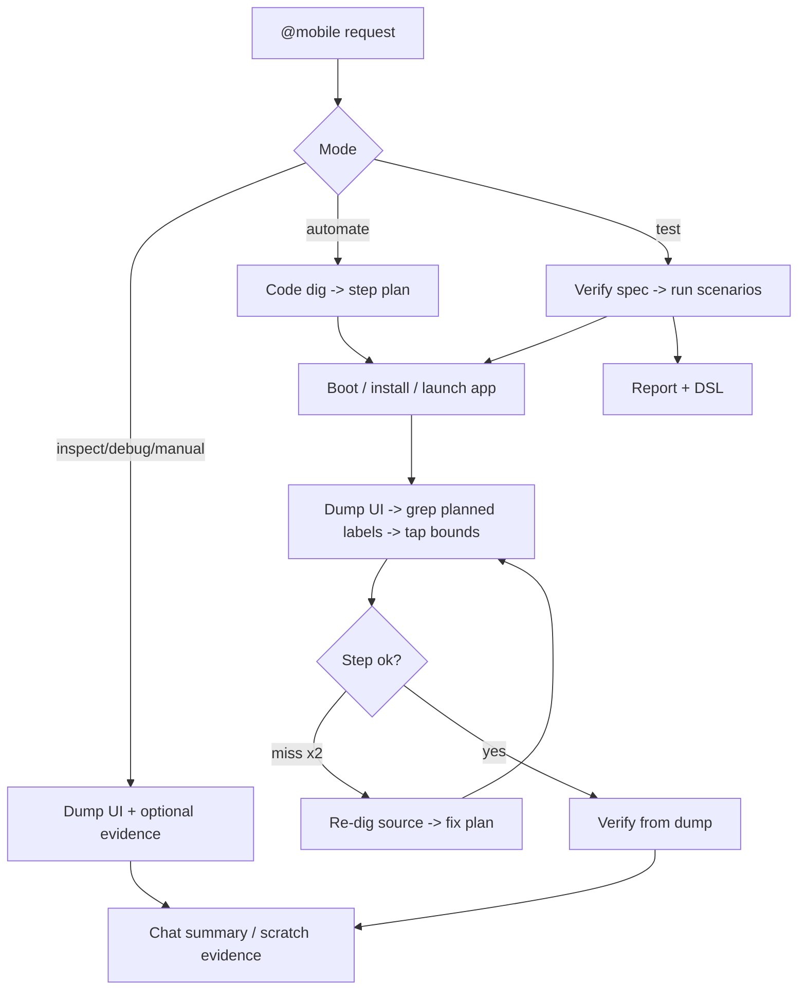

# tapwright

**`@mobile` for coding agents. Inspect, automate, and test real mobile apps.**

tapwright is a small pack of Markdown instructions and shell helpers. It helps coding agents
like Codex, Claude Code, Cursor, OpenCode, and Copilot work with **Android emulators** (`adb`)
and **iOS Simulators** (`simctl` + `idb`).

Put it in a mobile repo, fill in `tapwright.config.yml`, then ask your agent to use `@mobile`:

- `@mobile inspect` checks the current device, app, and screen.
- `@mobile automate ...` runs a one-off task, like logging in or opening a settings page.
- `@mobile manual ...` walks through a UI check one step at a time.
- `@mobile test ...` runs a `test-plan.md` and writes a report plus replayable DSL.
- `@mobile debug`, `record`, `replay`, and `compare` cover the usual follow-up work.

`/exec` and `/test` still work as aliases for older setups.

There is no app SDK, background service, or hosted runner. The agent uses local tools that mobile
developers already have around.

## Why this exists

Most agent-driven mobile tools start with screenshots. That works sometimes, but it is easy to
tap the wrong place and it burns context fast.

tapwright starts with the things your app already knows:

1. Read string resources and navigation files before touching the device.
2. Dump the live UI tree with `uiautomator` or `idb`.
3. Find real labels and bounds.
4. Tap those bounds.
5. Use screenshots only when the tree does not have enough information.

The goal is boring in a good way: fewer guessed taps, smaller screenshots, and test steps that
map back to real UI.

| | tapwright | Typical vision-first tool |
|---|---|---|
| How it finds targets | Source strings -> UI dump -> element bounds | Screenshot -> model guesses coords |
| LLM | The agent you already run | Bundled model + your API key |
| Runtime | Markdown + shell in your agent | Separate CLI / daemon / service |
| Tokens | Dump text + shrunk checkpoints | Full-res screenshot per step |

## Requirements

- macOS or Linux, `bash`/`zsh`.
- **Android:** Android SDK platform-tools (`adb`), an emulator (AVD) or connected device.
- **iOS (macOS only):** Xcode + a Simulator runtime, plus `idb`:
  ```bash
  brew tap facebook/fb && brew install idb-companion
  pip3 install fb-idb   # or: pipx install fb-idb
  ```
- A coding agent that reads skills/workflows from your repo (Cursor, Claude Code, Codex, ...).

## Quickstart

Simplest path: send this page to your coding agent and ask it to install tapwright in your app repo:

```text
https://raw.githubusercontent.com/amirghm/tapwright/main/docs/install-agent.md
```

If you already have the repo locally, use [docs/install-agent.md](docs/install-agent.md).

Then try:

```text
@mobile inspect
```

Manual local install:

```bash
# 1. Clone tapwright next to your app repo
git clone https://github.com/amirghm/tapwright.git

# 2. Install it into your mobile app repo
cd /path/to/your-app
/path/to/tapwright/install.sh            # auto-detects .cursor / .claude / .agents

# 3. Describe your app
cp /path/to/tapwright/config/tapwright.config.example.yml ./tapwright.config.yml
$EDITOR tapwright.config.yml             # package id, launch, string globs, ...
```

Then, in your agent:

```
@mobile inspect
@mobile automate on android: log in as qa@example.com and open the account screen
@mobile test CHECKOUT             # runs specs/CHECKOUT/test-plan.md, writes a report
```

See [docs/getting-started.md](docs/getting-started.md) for a full walkthrough and
[docs/mobile.md](docs/mobile.md) for the `@mobile` modes. See [examples/](examples/) for sample configs.

## What's in the box

```
pack/
  workflows/   mobile.md, exec.md, test.md
  skills/      mobile, exec-engine,
               test-engine,
               device-interaction (adb),
               device-interaction-ios (idb)
  scripts/     shrink-screenshot, adb/ios helpers, show-ios-simulator
  templates/   test-plan, test-report, e2e DSL + patterns
config/        tapwright.config.example.yml
docs/          getting-started, config-reference, writing-a-step-plan, supported-stacks
examples/      android-compose, ios-swiftui
```

## How it works



## Status & scope

v1 targets **Android + iOS** local emulators/simulators. Out of scope for now: web/browser
targets, real-device farms, a hosted CI service, and npm/pip publishing. Contributions welcome.

## License

Apache-2.0. See [LICENSE](LICENSE).
