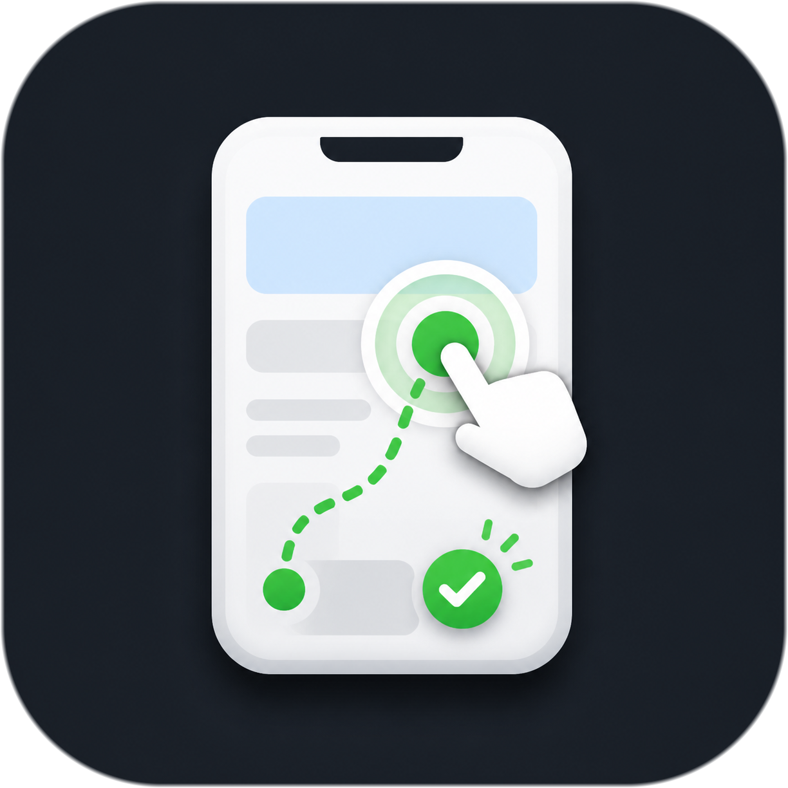

<p align="center">
  
</p>

<h1 align="center">tapwright</h1>

<p align="center">
  <strong><code>@mobile</code> for coding agents.</strong><br>
  Tell your agent what to do in your mobile app. It opens the app, taps around, checks the result, and reports back.
</p>

<p align="center">
  <a href="https://github.com/amirghm/tapwright/blob/main/LICENSE"></a>
  <a href="https://github.com/amirghm/tapwright"></a>
  <a href="docs/install-agent.md"></a>
</p>

## Install

Copy this and send it to your coding agent:

```text
Install tapwright here: https://raw.githubusercontent.com/amirghm/tapwright/main/docs/install-agent.md
```

That is it. The agent reads the page, installs the repo files, checks what mobile tools are
available, and tells you what it can run.

## What You Can Ask

```text
@mobile log in with the QA account and find the subscription settings
@mobile check if a new user can skip onboarding and reach the home screen
@mobile open the latest order and tell me if the refund button is available
@mobile find where the app asks for notification permission
@mobile compare this screen with the design
@mobile debug why login is stuck
```

If your coding tool does not support `@mobile`, use `/mobile` instead.

## Use Cases

| You want to know | Ask |
|---|---|
| What screen is open right now | `@mobile what screen is my app showing?` |
| Whether a flow still works | `@mobile check if checkout still works` |
| Where something lives in the app | `@mobile find the billing settings` |
| Whether a button or option is available | `@mobile open the latest order and check if refund is available` |
| Why a flow is stuck | `@mobile debug why login is stuck` |
| Whether UI matches a design | `@mobile compare this screen with the design` |
| Turn a repeated flow into a test | `@mobile record the onboarding flow` |
| Run a saved E2E plan | `@mobile test CHECKOUT` |

## Remembers Your App

Every request teaches tapwright a little more about your app. It builds an App
Map for each package or bundle ID, remembering verified screens, controls,
routes, and gates.

The next agent can start from that map instead of exploring the same screens
again. That makes automation and E2E runs more accurate, faster, and lighter on
tokens. Remembered paths are always checked against the live app before use.

No source code? It can build the map from the app running on an emulator,
Simulator, or an explicitly approved connected device.

## For Development And E2E

When you are building a feature, `@mobile` can act like the mobile check at the end of the task.

```text
@mobile test the login changes I just made
@mobile run the checkout plan on Android
@mobile run the checkout plan on iOS, visible, so I can watch
@mobile run CHECKOUT on both Android and iOS
@mobile run only E-2 from the checkout plan
@mobile record this reset-password flow as a test plan
```

For planned test runs, keep a `specs/<NAME>/test-plan.md`. tapwright writes the run output under
`specs/<NAME>/runs/` with a readable report, screenshots when useful, and replayable steps.

## What It Feels Like

You ask for the outcome. Your agent does the mobile work.

```text
You: @mobile log in with the QA account and find billing

Agent:
- opened the Android emulator
- logged in with the QA account
- found Billing under Account -> Settings
- confirmed the Upgrade button is visible
- saved a screenshot because the screen had dynamic pricing
```

No new test runner to learn before you can try it.

## Why It Works

tapwright gives your agent a simple rule: check the App Map, then tap.

When it already knows a verified route, it skips reading the code and checks the
route against the live UI tree. It looks at app strings and navigation files only
when the map has a gap or the app has changed. Then it taps real elements and
uses screenshots only when they help.

## Platforms

- Android works on macOS, Linux, and Windows. The agent checks the local device setup.
- iOS works on macOS. The agent checks the local Simulator setup.
- Physical devices require your explicit approval before the agent touches them.

## Docs

- [Agent install page](docs/install-agent.md)
- [`@mobile` examples and modes](docs/mobile.md)
- [App Memory and App Maps](docs/memory.md)
- [Getting started](docs/getting-started.md)
- [Config reference](docs/config-reference.md)
- [Supported stacks](docs/supported-stacks.md)
- [Writing a test plan](docs/writing-a-step-plan.md)

## License

Apache-2.0. See [LICENSE](LICENSE).
