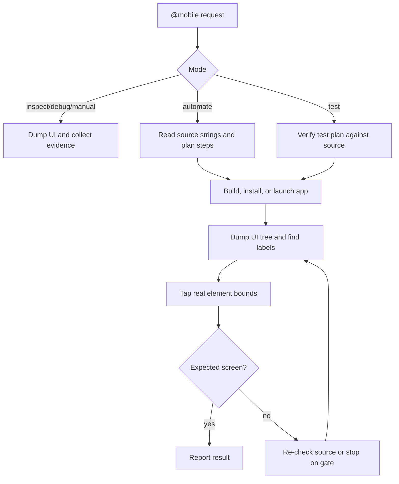

<p align="center">
  
</p>

<h1 align="center">tapwright</h1>

<p align="center">
  <strong><code>@mobile</code> for coding agents.</strong><br>
  Inspect, automate, debug, record, replay, compare, and E2E test real Android and iOS apps.
</p>

<p align="center">
  <a href="https://github.com/amirghm/tapwright/blob/main/LICENSE"></a>
  <a href="https://github.com/amirghm/tapwright"></a>
  <a href="docs/mobile.md"></a>
  <a href="docs/install-agent.md"></a>
</p>

tapwright is a small pack of Markdown instructions and shell helpers. It helps coding agents
like Codex, Claude Code, Cursor, OpenCode, and Copilot work with Android emulators and iOS
Simulators.

Put it in a mobile repo, fill in `tapwright.config.yml`, then ask your agent to use `@mobile`.

```text
@mobile inspect
@mobile automate log in and open the account screen
@mobile test CHECKOUT --ios --headless
```

`/exec` and `/test` still work as aliases for older setups.

## What You Get

| Mode | What it does |
|---|---|
| `@mobile inspect` | Checks the current device, app, screen, UI tree, and optional screenshot. |
| `@mobile automate ...` | Runs a one-off task, like logging in or opening a settings page. |
| `@mobile manual ...` | Walks through a UI check one action at a time. |
| `@mobile test ...` | Runs a `test-plan.md` and writes a report plus replayable DSL. |
| `@mobile debug ...` | Gathers UI dumps, screenshots, app state, and logs. |
| `@mobile record ...` | Saves performed actions as draft DSL. |
| `@mobile replay ...` | Runs an existing DSL or test flow. |
| `@mobile compare ...` | Compares a mobile screenshot with a design or reference image. |

There is no app SDK, background service, or hosted runner. The agent uses local tools that mobile
developers already have around.

## Why This Exists

Most agent-driven mobile tools start with screenshots. That works sometimes, but it is easy to
tap the wrong place and it burns context fast.

tapwright starts with the things your app already knows:

1. Read string resources and navigation files before touching the device.
2. Dump the live UI tree with `uiautomator` or `idb`.
3. Find real labels and bounds.
4. Tap those bounds.
5. Use screenshots only when the tree does not have enough information.

The goal is boring in a good way: fewer guessed taps, smaller screenshots, and test steps that
map back to real UI.

| | tapwright | Typical vision-first tool |
|---|---|---|
| Finds targets from | Source strings, UI dump, element bounds | Screenshot and guessed coordinates |
| Runs in | The agent you already use | A separate runtime or service |
| App changes needed | None | Often test IDs, SDKs, or extra setup |
| Evidence | Small screenshots, UI dumps, reports, DSL | Usually full screenshots |

## Quickstart

Send this page to your coding agent and ask it to install tapwright in your app repo:

```text
https://raw.githubusercontent.com/amirghm/tapwright/main/docs/install-agent.md
```

Then try:

```text
@mobile inspect
```

Manual local install:

```bash
git clone https://github.com/amirghm/tapwright.git
cd /path/to/your-app
/path/to/tapwright/install.sh
cp /path/to/tapwright/config/tapwright.config.example.yml ./tapwright.config.yml
$EDITOR tapwright.config.yml
```

## Requirements

- macOS or Linux with `bash` or `zsh`
- Android SDK platform-tools for Android runs
- Xcode, an iOS Simulator runtime, and `idb` for iOS runs
- A coding agent that can read repo instructions, skills, rules, or Markdown workflows

iOS setup:

```bash
brew tap facebook/fb
brew install idb-companion
pip3 install fb-idb
```

## What Is In The Repo

```text
pack/
  workflows/   mobile.md, exec.md, test.md
  skills/      mobile, exec-engine, test-engine,
               device-interaction, device-interaction-ios
  scripts/     adb helpers, iOS helpers, screenshot shrinker
  templates/   test plan, report, e2e DSL, patterns
config/        tapwright.config.example.yml
docs/          install, config, supported stacks, @mobile
examples/      Android Compose, iOS SwiftUI
```

## How It Works



## Docs

- [Getting started](docs/getting-started.md)
- [`@mobile` modes](docs/mobile.md)
- [Agent install page](docs/install-agent.md)
- [Config reference](docs/config-reference.md)
- [Supported stacks](docs/supported-stacks.md)
- [Writing a test plan](docs/writing-a-step-plan.md)

## Status

v1 targets local Android emulators and iOS Simulators. Physical devices require explicit user
confirmation before interaction. Web targets, device farms, hosted CI, and package publishing are
out of scope for now.

## License

Apache-2.0. See [LICENSE](LICENSE).
