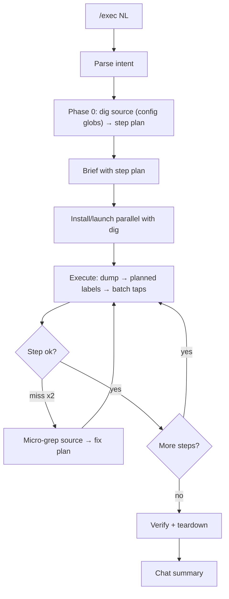

# `/exec` : Natural-Language Mobile Execution

**Goal:** Do a one-off task on a real emulator/simulator from plain English - log in, navigate, toggle a setting, complete a flow. No test plan, no DSL, no files in the repo.

**Priorities (in order):**
1. **Code dig → step plan** before any taps (labels + nav from your app source, per `tapwright.config.yml`)
2. **Speed** - batch taps, short sleeps, dump only when needed
3. **Clean finish** - verify from dump, teardown, chat summary only

**Read first:** the `exec-engine` skill, then the platform device skill:

| Platform | Device skill |
|---|---|
| Android (default) | `device-interaction` |
| iOS | `device-interaction-ios` |

## Usage (natural language only)

```
/exec log in as qa@example.com and open the account screen on android

/exec on ios headless: open settings and toggle notifications off

/exec complete onboarding and reach the home tab
```

**Invocation:** use `/exec ...` - not the workflow file path.

### vs `/test`

| | `/test` | `/exec` |
|---|---|---|
| Input | a spec's `test-plan.md` | Your sentence |
| Output | DSL + report | **Chat summary only** |
| Prep | Full verification | **Focused code dig → step plan** (mandatory) |

---

## Phase 0 - Code dig → step plan (mandatory, before taps)

**Do this before the Phase 2 brief and before any UI interaction.** Dig in parallel with device boot/launch when possible.

### Dig targets (from `tapwright.config.yml`)

| Need | Where |
|---|---|
| Exact CTA / screen titles (each locale) | `string_globs` - grep for the words in the task |
| Screen order / next routes | `nav_globs` |
| Known app-specific journeys | `known_flows` in config (use directly, still verify against dump) |
| Entry points / tabs | bottom-nav labels in string resources |

If no config exists, use the built-in glob defaults (see `config-reference.md`) and ask for the package/bundle id if the sentence didn't include it.

### Produce a step plan (keep in working memory - do **not** write repo files)

Numbered steps only, each with:

1. **Screen** expected (title / gate text)
2. **Action** (tap / type / scroll / confirm)
3. **Label needles** to grep in dump (across `locales`)
4. **Success signal** in next dump

**Rules:** dig first, execute second. Do **not** invent coordinates from screenshots when the dig gave labels. Re-dig only after 2 failed taps on the same step.

---

## Phase 1 - Parse the request

| Slot | Examples | Default |
|---|---|---|
| Platform | android, ios | Android |
| Speed | fast, asap, headless, background | **fast** when said; else Android batch / iOS visible |
| Credentials | email + password (or `accounts.*` in config) | existing session |
| Task | the verbs/objects | required |

If the task is unclear or ambiguous, ask **one** question, then continue.

---

## Phase 2 - Brief (max 6 lines) → start immediately

Post then run - no approval gate:

- Platform / speed mode
- Account email only (never password)
- **Step plan** (compact numbered list from Phase 0)
- One disambiguation note if needed

Do **not** narrate mid-run ("now tapping...", "looking for..."). Next chat message = final summary only unless blocked.

---

## Phase 3 - Resolve app & device (parallel with Phase 0)

Read `tapwright.config.yml`:

- **Android:** `android.package_id`, `android.launch`, `android.install` (prefer reinstalling an existing debug APK over a full build when one exists).
- **iOS:** `ios.bundle_id`, `ios.scheme`, `ios.build` (prefer an existing DerivedData `.app`). Start `idb companion` once.

| Speed | Behaviour |
|---|---|
| **fast / asap / headless** | No Simulator.app focus; batch taps; sleeps 0.3-1s (3-4s after launch/login/network) |
| visible (default iOS) | `show-ios-simulator.sh <UDID>`; longer pauses |

Emulators/simulators only unless the user consents to a physical device.

---

## Phase 4 - Execute (speed-first)

```
for each step in plan:
  dump → grep planned needles → tap center → (batch next 2-5 if same Shell OK)
  on miss: scroll once → re-dump → if still miss, micro-grep source → update step → retry once
verify final success signal from dump → teardown
```

| Do | Don't |
|---|---|
| Batch 2-5 actions per Shell (Android + fast iOS) | One-tap-per-message chatter |
| Dump after screen changes / before unknown CTAs | Dump after every tap |
| Use planned labels (each locale) | Guess from VLM first |
| Dismiss blockers fast (permission dialogs, ATT, notif modals, system alerts) via dump labels | Stall on optional prompts |
| Screenshot + VLM **only** if dump has no labels (empty/canvas tree); use `screenshot` helper (<=540) | Screenshot every step / full-res raw capture |
| Stop on a gate (wrong state) and report blocked | Random coordinates |

Android helpers: `source pack/scripts/adb-helpers.sh` (`export SERIAL=...`, `export PKG=<applicationId>`).
iOS helpers: `source pack/scripts/ios-helpers.sh` (`export UDID=...`). Taps from dump/AX, not shrunk PNG.

**No** Python orchestration scripts. **No** files written to the repo.

---

## Phase 5 - Teardown

1. Restore only if the user would care about the side effect (a demo toggle → toggle back). **Do not** undo the requested action itself (e.g. don't re-enable an account after the user asked to cancel it).
2. Stop app: `adb shell am force-stop <package_id>` / `xcrun simctl terminate <UDID> <bundle_id>`.

## Phase 6 - Chat summary only

Template in the `exec-engine` skill. No credentials in notes.

## Flow



## Notes

- Credentials are session-only; never persist to the repo. Passwords come from `accounts.*.password_env`.
- Structured QA with a report + DSL → `/test <SPEC>`.
