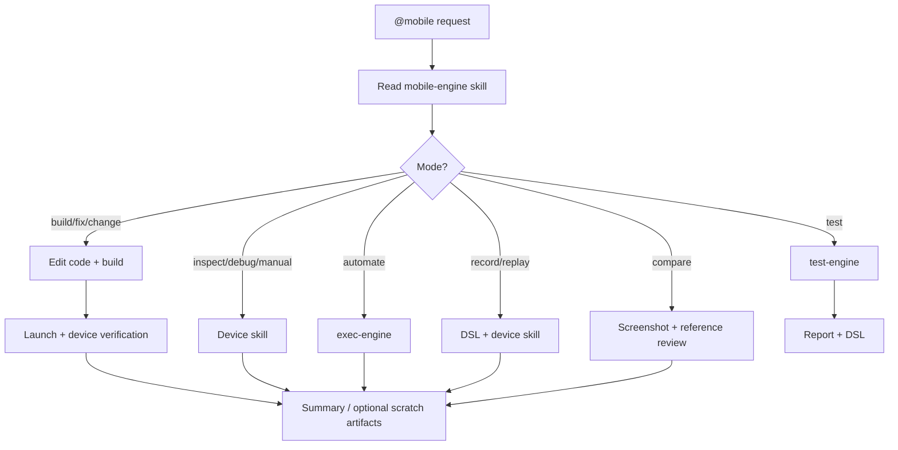

# `@mobile`

**Goal:** Give the user one visible mobile command. This workflow handles app
building/changes, mobile inspection, automation, manual UI checks, debugging,
recording, replay, compare, and E2E runs.

## Execute, do not rewrite

Invoking `@mobile`, `/mobile`, or explicitly asking to use this `mobile.md` file
means perform the request now. Never return a large prompt for another agent or
stop after a plan. For create/build/fix/change requests, edit the app, build it,
launch it, verify it on mobile, and iterate. Generate prompt text only when the
user explicitly says `prompt-only` or `do not implement`.

**Read first:** the `mobile-engine` skill. It routes to:

| Need | Skill / workflow |
|---|---|
| Android device control | `device-interaction` |
| iOS Simulator control | `device-interaction-ios` |
| Ad-hoc automation | `exec-engine` / `/exec` behavior |
| E2E execution | `test-engine` / `/test` behavior |
| Build/change app | Host coding tools, then platform device skill |

Every route reads and updates the App Map under
`.tapwright-memory/<platform>/<package-or-bundle-id>/app-map.yaml`.

## Usage

```text
@mobile what screen is my app showing?
@mobile build a daily planner and verify its main flow
@mobile fix the checkout UI and test it on Android
@mobile log in and open the account screen
@mobile manual test checkout on android
@mobile test CHECKOUT --ios --headless
@mobile debug app launch
@mobile record onboarding
@mobile replay specs/CHECKOUT/runs/android/<run_id>/e-1-checkout.dsl.yaml
@mobile compare current screen with <reference>
```

If the coding tool does not support `@mobile`, use `/mobile` instead. Both forms
run this workflow.

## Mode Selection

Infer the mode from the request:

| Mode | Route |
|---|---|
| `build` | Implement code, build/launch, then verify and iterate on device |
| `inspect` | Dump current UI, optional screenshot, summarize state |
| `automate` | Execute natural-language goal with `/exec` semantics |
| `manual` | Guided one-step UI testing |
| `test` | Execute `test-plan.md` with `/test` semantics |
| `debug` | Collect dump, screenshot, app/device state, optional logs |
| `record` | Execute and save provisional DSL in a timestamped run folder |
| `replay` | Execute an existing DSL/test flow |
| `compare` | Capture checkpoint and compare to provided reference/design |

Default platform: Android. Use iOS when the user says iOS/simulator or passes
`--ios`.

## Safety Defaults

- Prefer emulators/simulators.
- Physical devices require explicit user confirmation before interaction.
- Resolve from UI dumps/accessibility trees before tapping.
- Screenshots are evidence/fallback, not the primary selector system.
- Stop on gates and destructive confirmations unless the request explicitly
  includes that action.

## Artifacts

- `test` mode writes `specs/<SPEC>/runs/<platform>/<run_id>/`.
- Other modes write optional scratch evidence under
  `.tapwright-run/<YYYY-MM-DD>/<HH-mm-ssZ>-<mode>/`.
- One request uses one run folder. Reuse it for every screenshot, dump, log, and
  provisional DSL created for that request.
- Simple automation can be chat-only.
- App Memory is persistent and separate from timestamped run evidence.
- New test/config/source data updates unverified map candidates immediately;
  live verification promotes those candidates into trusted routes.

## Flow


