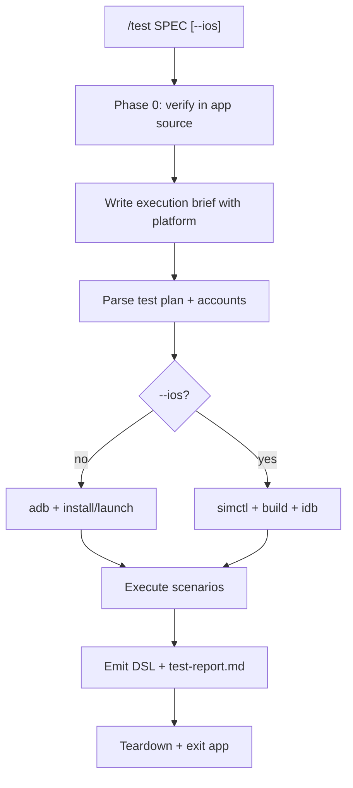

# `/test` : Execute a Mobile Test Plan

**Goal:** Take a spec's `test-plan.md` and run its E2E scenarios on a mobile emulator/simulator - resolving accounts, driving the UI, and recording each scenario as e2e DSL plus a report.

**Read first:** the `test-engine` skill (App Map + targeted verification + brief), the platform device skill below, and `pack/templates/e2e.md` (output layout + run folders).

Before execution, merge new or edited test scenarios into the per-app App Map as
unverified candidates. After execution, promote verified candidates or record
their failed/blocked status.

| Platform | Device skill |
|---|---|
| Android (default) | `device-interaction` |
| iOS (`--ios`) | `device-interaction-ios` |

## Usage

```
/test SPEC                     # Android emulator (default)
/test SPEC --android           # Android only (explicit)
/test SPEC --ios               # iOS simulator - visible (opens Simulator.app)
/test SPEC --ios --headless    # iOS background only - no Simulator.app, fast batching
/test SPEC --android --ios      # Both platforms in one run (shared run_id)
/test SPEC E-1                 # single scenario on Android
/test SPEC --ios E-1           # single scenario on iOS
/test SPEC all                 # all scenarios, Android only
```

Here `SPEC` is a folder under `specs/` (or a path you pass) that contains `test-plan.md`.

**Invocation:** use the `/test` command with flags - not the workflow file path.

For ad-hoc tasks without a test plan, use `/exec` (natural language, chat summary only).

### How to drive the UI (mandatory)

Follow the **device skills** only - **no Python orchestration scripts**. **Speed first.**

**Golden loop (fast):**

```
dump hierarchy → grep text/bounds → tap → batch next taps → screenshot at checkpoints only
```

| When | Tool |
|---|---|
| **Find** tap targets, nav tabs, buttons | **XML/JSON dump** - `uiautomator` / `idb ui describe-all` → grep text → tap center |
| **Assert** values, subtitles, gates | **Grep the dump** for the expected text |
| **Verify** when dump is insufficient | **VLM** - read a checkpoint PNG only (value not in tree, ambiguous screen). PNGs are auto-shrunk (<=540 long-edge) via helpers |
| **Stuck** after 2 failed taps | **Source code** - grep `string_globs` / `nav_globs` for the nav path, then resume |

**Do not** screenshot + VLM after every tap. **Do not** narrate or re-plan mid-scenario. **Batch** multiple taps in one Shell call with `sleep` (headless Android/iOS).

Write **DSL YAML only after** the scenario finishes.

Android helpers: `source pack/scripts/adb-helpers.sh` - `dump_ui`, `tap_text`, `screenshot` (shrink).
iOS helpers: `source pack/scripts/ios-helpers.sh` - `screenshot` (shrink). Taps always from dump/AX, not from the shrunk PNG.

### iOS simulator visibility

| Flag | Effect |
|---|---|
| *(none)* on `--ios` | **Visible** (default) - boot simulator, open + focus Simulator.app (`show-ios-simulator.sh`). Slower pauses so you can watch. |
| `--headless` | **Background** - `simctl` + `idb` only; **do not** open Simulator.app. Fast batched taps. |

Record the mode in the report and DSL `meta.simulator_visibility` (`visible` | `headless`).

---

## Phase 0 - Verify scenarios in the codebase (do NOT skip)

Before touching a device, execute **Phase 0** from the `test-engine` skill:

1. Read each E2E scenario in the spec's `test-plan.md`.
2. Grep/read the app source (`string_globs`, `nav_globs`) - navigation, gating conditions, exact label strings.
3. Confirm account preconditions the plan requires (logged in vs out, a particular state).
4. Note label variants for each locale in `tapwright.config.yml`.
5. Write a short **Execution brief** (include **platform**) in chat, then **continue immediately** - `/test` is an execution command; do not wait for a second confirmation.

If preconditions require setup, include those steps in the brief.

---

## Phase 1 - Locate & parse the test plan

1. Resolve the spec folder (under `specs/`, or the path given).
2. Read `test-plan.md`.
3. If missing, stop and ask the user to create one (see `pack/templates/test-plan.md`).
4. Parse scenarios, accounts, preconditions, and step tables.
5. Filter to a single scenario if the user specified one.

## Phase 2 - Resolve the test account (per scenario)

1. **Test plan first** - use the named account + any setup steps.
2. **Config** - `accounts.*` in `tapwright.config.yml` (password via `password_env`).
3. **Ask the user** - unusual account states or when the above don't apply.

Never store passwords in DSL/report files.

## Phase 3 - Prepare the device

| Platform | Skill | Discovery |
|---|---|---|
| Android | `device-interaction` | `adb devices -l`; emulators only unless the user consents to physical |
| iOS | `device-interaction-ios` | `xcrun simctl list devices booted`; simulators only unless the user consents to physical |

Disambiguate when multiple devices/simulators are online.

**iOS visibility:** default (`--ios` only) → `show-ios-simulator.sh <UDID>` + longer pauses; `--headless` → skip it, batch taps, short pauses.

## Phase 4 - Build, install & launch

Use `tapwright.config.yml`:

- **Android:** run `android.install` (or `adb install -r -t <android.apk>`), then `adb shell am start -n <android.launch>`.
- **iOS:** run `ios.build`, locate the `.app` under DerivedData, `simctl install`, then `simctl launch <ios.bundle_id>`. Set any `ios.resource_flavor_env` first.

Record `meta.platform` and the id used (`package_id` / `bundle_id`) in the DSL.

## Phase 5 - Execute each scenario

Follow the test-plan step table. **Minimize Shell round-trips.**

1. **Dump** the UI once per screen (reuse the last dump if still on the same screen).
2. **Grep** the dump for the label from the test plan (text per locale, resource key, nav tab) → compute tap coords → tap.
3. **Batch** the next 2-5 taps in one Shell block with `sleep 1` between (headless iOS or Android). Visible iOS: one tap per call, ~3s pause.
4. **Assert** from dump text when possible; VLM on a checkpoint PNG only when the dump can't confirm.
5. **Screenshot** only at checkpoints named in the test plan - save to `resources/` via the platform `screenshot` helper (auto-shrink <=540 long-edge + `.meta`). Taps from dump/AX, not from the shrunk image.
6. **Stuck?** (element missing after scroll, wrong screen after 2 taps) → check
   source for the nav path when available; otherwise inspect nearby live targets,
   verify the route, and update the App Map. Don't loop dumps/screenshots without acting.

### Source-code fallback (deadlock only)

Trigger after **2 failed tap attempts** or a missing CTA after scroll - not proactively.

1. Grep visible strings → `nav_globs`, screen definitions, string resources.
2. Resume with code-backed labels; dump → tap.
3. Note non-obvious paths in the report.

### Blocked vs fail

- **Gate in dump** (disabled control, "not available", wrong state) → **blocked** - cite the gate + dump snippet; no random coordinates.
- **Path exhausted** → **fail** - last screenshot + what was tried.

### After the scenario

Write that scenario's DSL (Phase 6). The YAML records the dumps/taps actually used, not the test plan verbatim.

## Phase 6 - Emit e2e DSL & run folder

At **run start**, create a unique run folder per platform (UTC timestamp `run_id`):

```
specs/<SPEC>/runs/android/YYYY-MM-DDTHH-mm-ssZ/    # /test or --android
specs/<SPEC>/runs/ios/YYYY-MM-DDTHH-mm-ssZ/        # --ios
```

Use the **same `run_id`** when running `--android --ios` in one session.

From `pack/templates/e2e-dsl.yaml` and `pack/templates/e2e-patterns.yaml`:
- Report: `runs/<platform>/<run_id>/test-report.md` (from `pack/templates/test-report.md`)
- DSL: `runs/<platform>/<run_id>/e-<n>-<slug>.dsl.yaml` (include `meta.platform`)
- Assets: `runs/<platform>/<run_id>/resources/`

Use **discover → vars → assert(intent)** - never hardcode volatile values (dates, amounts, dynamic copy) in steps (see `test-engine`).

Each new `/test` creates a **new** run folder; never overwrite a previous run.

## Phase 7 - Report

Write `runs/<platform>/<run_id>/test-report.md` with:
- Summary table (platform, device, account, pass/fail counts, teardown)
- Per-scenario results with links to DSL + screenshots
- `discovered:` values aggregated across scenarios
- How it was tested (phases, order, gates)
- Blockers / notes

Also give a short chat summary pointing to the report path.

### Phase 7b - Figma comparison (UI-change tasks only)

When the spec verifies **visual UI changes** and a Figma URL is available (e.g. in the spec or config):
1. Fetch the design via the Figma MCP (`get_design_context` / `get_screenshot`).
2. Capture matching emulator/simulator screenshots at the same checkpoints (helpers shrink to <=540 long-edge - fine for qualitative compare).
3. Add a **Figma design comparison** table to the report (side-by-side links + pass/review/fail per screen).

**Caveat:** not pixel-perfect; fonts, density, dynamic data, and localization differ from Figma.

## Phase 8 - Teardown (always run)

Restore device/account to the pre-test state, then exit the app:

1. **Reversible setup must be undone** (e.g. if a scenario canceled something, restore it).
2. **Exit the app:** Android `adb shell am force-stop <package_id>` / iOS `xcrun simctl terminate <UDID> <bundle_id>`.
3. Note in the report whether state was restored successfully.

## Flow



## Notes

- Verification tooling only - no app code changes unless the user asks.
- Encode recurring setup/journeys as `known_flows` in `tapwright.config.yml`.
